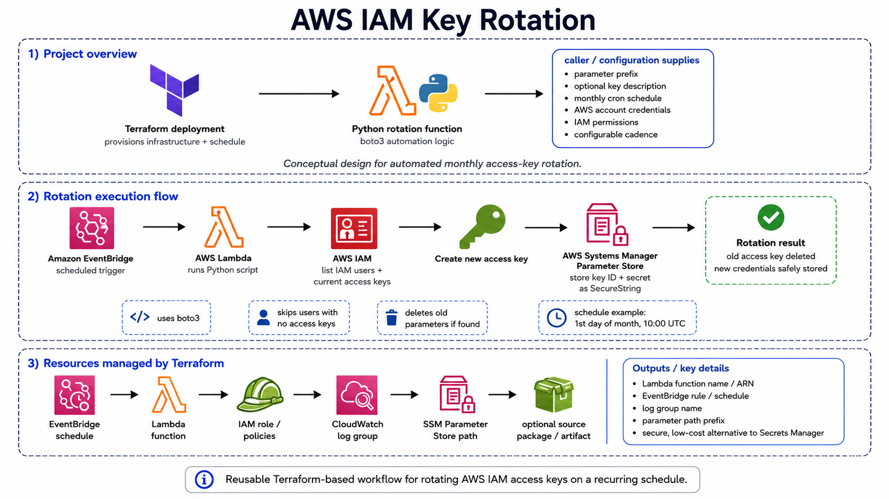

# AWS IAM Access Key Rotation

A Terraform-managed AWS IAM access key rotation project that uses AWS Lambda, IAM, Systems Manager Parameter Store, and EventBridge Scheduler to automatically rotate IAM user access keys. This project is an updated version of the now archived [IAM-Key-Rotation.](https://github.com/colby-smith/IAM-Key-Rotation)

## 📘 Overview

This repository provisions an automated IAM access key rotation workflow on AWS. The solution uses EventBridge Scheduler to invoke a Lambda function on a defined schedule. The Lambda function checks IAM users, creates a new access key, stores the new credentials in AWS Systems Manager Parameter Store as SecureString parameters, and removes the old access key. Made as a cost-efficient secure way of keeping user credentials safe and security complient without using secrets manager.

The infrastructure is managed with Terraform and supports separate development, staging, and production deployments using environment-specific `variables.tfvars` files.



## 🎯 Purpose of This Repository

The purpose of this repository is to automate IAM access key rotation using serverless AWS services and infrastructure-as-code without using secrets manager.

The project is designed to:

* rotate IAM user access keys automatically
* store new access keys securely in SSM Parameter Store
* schedule key rotation using EventBridge Scheduler
* deploy infrastructure using Terraform
* separate development, staging, and production configuration
* avoid hardcoding environment-specific values in Terraform resources
* demonstrate secure AWS automation using Lambda and IAM

## ✨ Features

* AWS Lambda function for IAM access key rotation.
* EventBridge Scheduler rule to run the rotation process automatically.
* SSM Parameter Store SecureString storage for new access key values.
* Terraform-managed IAM roles and policies.
* Environment-specific naming using `dv`, `st`, and `pr` suffixes.
* Environment-specific variables using separate `variables.tfvars` files.
* Provider-level default tags applied through Terraform.
* Local Lambda packaging script.
* Local unit tests using `pytest`, `moto`, and `boto3`.

## 📦 Usage

Each environment has its own Terraform variable file:

*Note: this project can still be used in a single or dual account/environment withtout needed to changed the core code, just use/adjust a single tfvars file found in either dv,st, or pr as your main tfvars file.*

```text
dv/variables.tfvars
st/variables.tfvars
pr/variables.tfvars
```

Example development values:

```hcl
project_name       = "iam-key-rotation"
environment        = "development"
environment_suffix = "dv"

new_key_description = "Development access key created by automated IAM key rotation"
parameter_prefix    = "/iam-key-rotation/dv/users/"

schedule_expression = "cron(0 10 1 * ? *)"
```

Run Terraform for development:

```bash
terraform init -backend-config="key=iam-key-rotation/dv/terraform.tfstate" -reconfigure
terraform plan -var-file=dv/variables.tfvars
terraform apply -var-file=dv/variables.tfvars
```

Run Terraform for staging:

```bash
terraform init -backend-config="key=iam-key-rotation/st/terraform.tfstate" -reconfigure
terraform plan -var-file=st/variables.tfvars
terraform apply -var-file=st/variables.tfvars
```

Run Terraform for production:

```bash
terraform init -backend-config="key=iam-key-rotation/pr/terraform.tfstate" -reconfigure
terraform plan -var-file=pr/variables.tfvars
terraform apply -var-file=pr/variables.tfvars
```

The Lambda package path used by Terraform is:

```hcl
filename         = "src/lambda_function.zip"
source_code_hash = filebase64sha256("src/lambda_function.zip")
```

## 🏗️ Infrastructure

The infrastructure is managed with Terraform.

The main AWS services used are:

* AWS Lambda
* AWS IAM
* Amazon EventBridge Scheduler
* AWS Systems Manager Parameter Store
* Amazon CloudWatch Logs
* Amazon S3 for Terraform remote state

### Access key rotation architecture

```text
EventBridge Scheduler
  -> Lambda Function
  -> IAM Users
  -> Create New Access Key
  -> Store New Key in SSM Parameter Store
  -> Delete Old Access Key
```

### Environment naming

Resources use a shared naming prefix based on the project name and environment suffix.

Example naming pattern:

```text
iam-key-rotation-dv-lambda
iam-key-rotation-st-lambda
iam-key-rotation-pr-lambda
```

The same pattern is used for IAM roles, IAM policies, and EventBridge schedules.

### Tags

Common tags are applied using Terraform provider-level default tags.

Example tags:

```hcl
Project     = "iam-key-rotation"
Environment = "development"
Repository  = "AWS-Access-Key-Rotation"
ManagedBy   = "Terraform"
```

Resource-specific `Name` tags are added directly to supported resources.

Example:

```hcl
tags = {
  Name = "${local.name_prefix}-lambda"
}
```

### Parameter Store paths

The Lambda function stores rotated access keys under an environment-specific SSM path.

Development example:

```text
/iam-key-rotation/dv/users/example-user/access_key_id
/iam-key-rotation/dv/users/example-user/secret_access_key
```

Staging example:

```text
/iam-key-rotation/st/users/example-user/access_key_id
/iam-key-rotation/st/users/example-user/secret_access_key
```

Production example:

```text
/iam-key-rotation/pr/users/example-user/access_key_id
/iam-key-rotation/pr/users/example-user/secret_access_key
```

## 🧪 Testing

The Lambda function can be tested locally using `pytest`, `moto`, and `boto3`.

Install test dependencies:

```bash
pip install pytest moto boto3
```

Run the tests:

```bash
pytest -v
```

The tests validate that:

* a user with one active access key can be rotated
* the old access key is removed
* the new access key ID is stored in Parameter Store
* the new secret access key is stored in Parameter Store
* users with no access keys are skipped
* users with two access keys are skipped
* inactive access keys are skipped
* the environment-specific parameter prefix is used

The test file is located at:

```text
tests/test_lambda_function.py
```

## 📄 License

[MIT License](./LICENSE)
